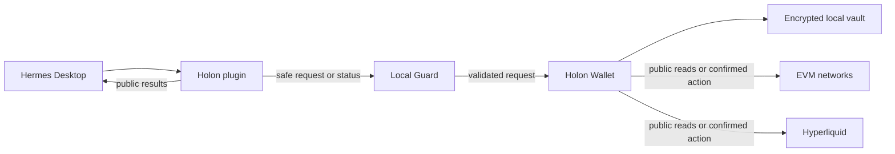

# Holon

Holon helps you use crypto through a personal AI agent. Today it works with Hermes.

You can ask Hermes to inspect a portfolio, compare supported Earn opportunities,
or prepare a supported action. Holon turns the request into a bounded flow. When
an action needs a signature, the separate Holon Wallet shows the exact action and
only you can approve it.

Your seed phrase, private keys, and Wallet password stay in Wallet. Hermes and the
AI model cannot read them, sign on your behalf, or take control of the final decision.

> **Alpha status.** Holon is unsigned alpha software for controlled personal use
> and technical review. It is not a production consumer wallet.

## How Holon works



1. You tell Hermes what you want to do.
2. The Holon plugin and Local Guard check whether the request is supported and safe.
3. For any protected action, Holon opens the separate Wallet.
4. You review the exact action and decide locally whether to continue.

The Wallet vault has no data path to Hermes. Read the
[architecture overview](docs/ARCHITECTURE.md) for component boundaries and data flow.

## What you can do today

The default `extended` composition contains Wallet, Guard, Earn, built-in Lending,
and the removable public `holon.perpdex` module.

- View public native and curated-token balances on Ethereum, Base, Arbitrum One,
  OP Mainnet, Polygon, and BNB Smart Chain.
- Prepare supported ETH and USDC transfers on Ethereum and Base routes only.
- Compare Base native-USDC rates and positions for Aave V3, Compound III, and
  the selected Morpho V1 vault through Holon Earn.
- Fund a Hyperliquid trading account with Arbitrum native USDC.
- Inspect Hyperliquid BTC, ETH, and SOL markets and portfolio state.
- Prepare BTC, ETH, or SOL LONG and SHORT positions, reduce-only closes, and
  supported official HLP actions through local Wallet Review.
- Reopen bounded public result details from Wallet History.

Every signable action still needs a new local Wallet Review, fresh password entry,
and explicit confirmation. Holon does not retry a financial action automatically.

## Hermes commands

- `/holon` for Wallet and general Holon guidance;
- `/earn-holon` for normalized Earn views;
- `/lending-holon` for supported Base Lending flows;
- `/perpdex-holon` for Hyperliquid PerpDEX flows.

## Control and safety

- A message in Hermes never authorizes a signature.
- Holon signs only the exact action shown in Wallet. A changed, expired,
  interrupted, or uncertain action cannot be reused.
- Public results keep `LIVE`, `CACHED`, `STALE`, `UNAVAILABLE`, pending, and
  unknown states distinct. Missing data is not a zero balance, and an uncertain
  transaction is not confirmed.
- Never copy recovery material, private keys, Wallet passwords, decrypted vault
  content, raw signed bytes, or secret-bearing screenshots into Hermes, logs,
  diagnostics, or public material.
- Real-fund use requires a separately approved low-value flow and current review.

## Current scope

The alpha supports Windows 11 x64 and Hermes `>=0.18.2,<0.19.0`. Wallet public
reads span the six listed EVM networks, while transfers remain limited to approved
Ethereum and Base routes. Lending is limited to Base native USDC and the three
pinned profiles. PerpDEX is limited to the stated Hyperliquid funding, BTC/ETH/SOL
position, reduce-only close, and official HLP flows.

Hardware wallets, autonomous trading, background capital movement, arbitrary
protocols, and consumer-grade production guarantees are outside this alpha.

## Installation

Download the Windows installer from the
[v0.2.0-alpha pre-release](https://github.com/yarinka-yyy/holon/releases/tag/v0.2.0-alpha):

- [Holon-0.2.0-alpha-Setup.exe](https://github.com/yarinka-yyy/holon/releases/download/v0.2.0-alpha/Holon-0.2.0-alpha-Setup.exe)
- [SHA256SUMS.txt](https://github.com/yarinka-yyy/holon/releases/download/v0.2.0-alpha/SHA256SUMS.txt)

This alpha installer is unsigned. Verify the downloaded file before running it:

```powershell
Get-FileHash .\Holon-0.2.0-alpha-Setup.exe -Algorithm SHA256
```

Compare the result with `SHA256SUMS.txt`. A checksum detects a damaged or
different download, but it does not authenticate the publisher as a code
signature would.

See [the installation guide](packaging/INSTALL.md) for Windows requirements,
data-preserving maintenance, troubleshooting, and source builds.

## Repository layout

| Path | Purpose |
| --- | --- |
| `src/` | Wallet, Guard, Hermes plugin, shared contracts, Earn, and Lending code |
| `modules/` | Build-selected optional modules, including `holon.perpdex` |
| `skills/` | Stable internal Hermes skill packages |
| `tests/` | Deterministic, UI, integration, and packaged verification |
| `packaging/` | Windows installer and package-build support |
| `docs/` | Public architecture material |

Generated `build/`, `dist/`, virtual environments, Wallet data, diagnostics, and
release archives are ignored by Git and are not source artifacts.

## Development verification

The source repository targets CPython 3.13.14 and uses `uv` for the locked
development environment:

```powershell
git clone https://github.com/yarinka-yyy/holon.git
cd holon
uv sync --locked --all-groups
.\.venv\Scripts\python.exe -m pytest
```

Building a local unsigned Setup additionally requires the official Inno Setup
compiler. See [the developer build guide](packaging/INSTALL.md#developer-build).

## License

Holon is licensed under the [Apache License 2.0](LICENSE). Bundled third-party
software keeps its own licenses, listed in [NOTICE](NOTICE) and
[THIRD_PARTY_LICENSES.txt](THIRD_PARTY_LICENSES.txt).
