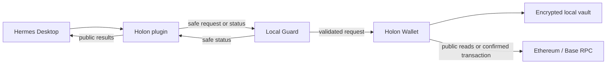

# Holon

Holon helps you use crypto through a personal AI agent. Today it works with Hermes.

You can ask Hermes to check balances, compare lending rates, or prepare a supported transfer. Holon turns that request into a clear, supported flow. When an action needs a signature, the separate Holon Wallet shows exactly what will happen and only you can approve it.

Your seed phrase, private keys, and Wallet password stay in Wallet. Hermes and the AI model cannot read them, sign on your behalf, or take control of the final decision.

> **Alpha status.** Holon is alpha software for controlled personal use and technical review. It is not a production consumer wallet.

## How Holon works



1. You tell Hermes what you want to do.
2. The Holon plugin and Local Guard check whether the request is supported and safe.
3. For any action that needs approval, Holon opens the separate Wallet.
4. You review the exact action, enter the Wallet password locally, and choose whether to sign it.

The Wallet vault has no data path to Hermes. Read the [architecture overview](docs/ARCHITECTURE.md) for component boundaries and data flow.

## What you can do today

- Open a Wallet from Hermes and view public ETH and USDC balances on Ethereum Mainnet and Base.
- Create or import a Wallet profile inside the local Wallet application.
- View local Wallet history and supported token approvals.
- Compare Base native-USDC rates and positions for Aave V3, Compound III, and the selected Morpho V1 vault.
- Prepare supported ETH or USDC transfers and supported Base-USDC lending supply or withdrawal actions.

Every signable action still needs a new local Wallet review, fresh password entry, and explicit confirmation.

## Control and safety

- A message in Hermes never authorizes a signature.
- Holon signs only the exact action shown in Wallet. A changed, expired, interrupted, or uncertain action cannot be reused.
- Public results keep `LIVE`, `CACHED`, `STALE`, `UNAVAILABLE`, pending, and unknown states distinct. Missing data is not a zero balance, and an uncertain transaction is not confirmed.
- Never copy recovery material, private keys, Wallet passwords, decrypted vault content, raw signed bytes, or secret-bearing screenshots into Hermes, logs, diagnostics, or public material.
- A real-fund demonstration needs a separate human-approved low-value flow. Holon never retries a financial action automatically.

## Current scope

The alpha focuses on Windows 11, Hermes `>=0.18.2,<0.19.0`, Ethereum Mainnet, Base, ETH, and native USDC. Lending is limited to Base native USDC and the three pinned Aave, Compound, and Morpho profiles.

Future networks, broader token support, hardware wallets, automatic trading, and automatic rebalancing are not part of this alpha.

## Installation

Download the Windows installer from the
[v0.1.0-alpha pre-release](https://github.com/yarinka-yyy/holon/releases/tag/v0.1.0-alpha):

- [Holon-0.1.0-alpha-Setup.exe](https://github.com/yarinka-yyy/holon/releases/download/v0.1.0-alpha/Holon-0.1.0-alpha-Setup.exe)
- [SHA256SUMS.txt](https://github.com/yarinka-yyy/holon/releases/download/v0.1.0-alpha/SHA256SUMS.txt)

This alpha installer is unsigned. Verify the downloaded file before running it:

```powershell
Get-FileHash .\Holon-0.1.0-alpha-Setup.exe -Algorithm SHA256
```

Compare the result with `SHA256SUMS.txt`. A checksum detects a damaged or
different download, but it does not authenticate the publisher as a code
signature would.

See [the installation guide](packaging/INSTALL.md) for Windows requirements,
data-preserving maintenance, troubleshooting, and source builds.

## Repository layout

| Path | Purpose |
| --- | --- |
| `src/` | Wallet, Guard, Hermes plugin, shared contracts, and Lending code |
| `skills/` | Hermes instructions for the `holon` and `holon-lending` capabilities |
| `tests/` | Deterministic and component-level verification |
| `packaging/` | Windows installer and package-build support |
| `docs/` | Public architecture material |

Generated `build/`, `dist/`, virtual environments, Wallet data, diagnostics, and release archives are ignored by Git and are not source artifacts.

## Development verification

The source repository targets CPython 3.13.14 and uses `uv` for the locked development environment:

```powershell
git clone https://github.com/yarinka-yyy/holon.git
cd holon
uv sync --locked --all-groups
.\.venv\Scripts\python.exe -m pytest
```

Building a local unsigned Setup additionally requires the official Inno Setup compiler. This is a source-build procedure, not an end-user installation path. See [the developer build guide](packaging/INSTALL.md#developer-build).

## License

Holon is licensed under the [Apache License 2.0](LICENSE). Bundled third-party
software keeps its own licenses, listed in [NOTICE](NOTICE) and
[THIRD_PARTY_LICENSES.txt](THIRD_PARTY_LICENSES.txt).
