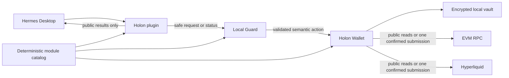

# Holon architecture

Holon separates conversational coordination from security and secret handling.
The model can request only narrow, versioned capabilities; it is never policy or
signing authority.

The encrypted vault has no data path to Hermes. Secret input and decrypted key
material exist only inside Wallet.

## Components

| Component | Responsibility | Cannot do |
| --- | --- | --- |
| Hermes | Interpret intent, request approved capabilities, explain public results | Receive secrets or authorize signing through chat |
| Holon plugin | Register narrow Hermes capabilities and enforce protected-flow blocking | Import Wallet vault or signing libraries |
| Local Guard | Coordinate one protected flow, validate integrity and compatibility, enforce recovery state | Hold Wallet secrets or sign transactions |
| Holon Wallet | Handle secret UI, encrypted vault, exact review, authentication, signing, and history | Expose secret material to Hermes |
| Earn and Lending | Normalize supported public opportunities and build semantic requests for pinned Lending profiles | Accept arbitrary contracts or create a parallel signer |
| PerpDEX module | Read supported Hyperliquid state and build bounded funding, position, close, and HLP actions | Load dynamically, bypass Wallet Review, or retry a protected action |

## Deterministic composition

Base Holon contains Wallet, Guard, Earn, and built-in Lending. The default
`extended` release adds the removable public `holon.perpdex` module. Every build
uses explicit module source roots, strict manifests, a canonical catalog, and
hash-covered package ownership. There is no runtime module scan, marketplace,
remote discovery, or arbitrary code loading.

The four stable installation IDs are `holon`, `holon-earn`, `holon-lending`, and
`holon-perpdex`. Their public Hermes commands are `/holon`, `/earn-holon`,
`/lending-holon`, and `/perpdex-holon`. Public names may improve independently
while installation ownership and rollback stay stable.

Core and Earn remain complete when PerpDEX is absent. Wallet, Guard, and the
Hermes package receive the same generated catalog, so a missing, changed, or
incompatible module fails closed before protected authority is granted.

## Data and authority flow

### Public read

1. Hermes invokes a schema-validated public capability.
2. Holon reads approved public Wallet, protocol, or Hyperliquid data.
3. Hermes receives a public result or a safe `LIVE`, `CACHED`, `STALE`,
   `UNAVAILABLE`, error, or refusal state.

Public reads do not request a Wallet password or create signing authority. Wallet
portfolio reads cover six configured EVM networks. Transfer authority remains
limited to supported Ethereum and Base routes.

### Protected action

1. Hermes supplies only the semantic request, such as network, amount, side,
   leverage, or a pinned protocol action.
2. Guard validates scope, compatibility, policy, replay state, fresh public
   state, and protected-flow availability.
3. Wallet independently derives or verifies the exact action, displays all
   material fields, and asks for fresh local authentication and confirmation.
4. Wallet revalidates immediately before signing, submits at most once, and
   stores only bounded secret-free public status and history evidence.
5. Guard returns a safe terminal or recovery state. Hermes never receives the
   password, key, signature, signed bytes, or raw calldata.

Any changed material field, expiry, cancellation, interruption, integrity
mismatch, or uncertainty ends authority instead of attempting an automatic retry.

## Supported protocol boundaries

Lending is restricted to Base native USDC and integrity-pinned Aave V3,
Compound III, and selected Morpho V1 profiles. Wallet derives approved contract
targets and methods from those profiles; chat cannot provide arbitrary contracts,
calldata, beneficiaries, or receivers.

PerpDEX is restricted to Hyperliquid BTC, ETH, and SOL. Supported protected
operations are funding through Arbitrum native USDC, LONG and SHORT position
entry, reduce-only close, and selected official HLP actions. Fresh public reads,
exact Wallet Review, local authentication, bounded price protection, and
single-attempt submission remain mandatory.

## Installation and integrity

The per-user Windows Setup separates replaceable program files from encrypted
Wallet data. Reinstall, upgrade, and ordinary uninstall preserve Wallet data,
settings, and secret-free journals by default.

The release manifest records composition, module and package versions, compatible
Hermes range, owned skill IDs, and SHA-256 hashes. Setup verifies staged and
installed files. A missing, changed, or incompatible critical component disables
protected authority while keeping compatible read-only diagnostics available.

For supported scope and user-facing limits, return to the [README](../README.md).
