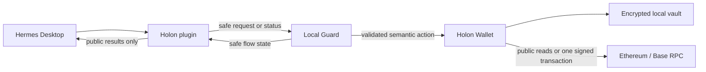

# Holon architecture

Holon separates conversational coordination from security and secret handling. The model can request only narrow, versioned capabilities; it is never policy or signing authority.

The encrypted vault has no data path to Hermes. Secret input and decrypted key material exist only inside Wallet.

## Components

| Component | Responsibility | Cannot do |
| --- | --- | --- |
| Hermes | Interpret intent, request approved capabilities, explain public results | Receive secrets or authorize signing through chat |
| Holon plugin | Register narrow Hermes capabilities and enforce protected-flow tool blocking | Import Wallet vault or signing libraries |
| Local Guard | Coordinate one protected flow, validate integrity/compatibility, enforce recovery state | Hold Wallet secrets or sign transactions |
| Holon Wallet | Handle secret UI, encrypted vault, exact review, fresh authentication, signing, and history | Expose secret material to Hermes |
| Lending services | Read selected public protocol data and construct semantic requests for pinned profiles | Accept arbitrary calldata or create a parallel signer |

## Data and authority flow

### Public read

1. Hermes invokes a schema-validated public capability.
2. Holon reads approved public Wallet or protocol data.
3. Hermes receives a public result or a safe `LIVE`, `STALE`, `UNAVAILABLE`, error, or refusal state.

Public reads do not request a Wallet password or create signing authority.

### Protected action

1. Hermes supplies only the semantic request: for example, network, asset, amount, recipient, or a pinned Lending operation.
2. Guard validates scope, compatibility, policy, replay state, and protected-flow availability.
3. Wallet independently derives the exact transaction, displays all material fields, and asks for fresh local authentication and explicit confirmation.
4. Wallet revalidates immediately before signing, broadcasts at most once, and stores only secret-free public status/history data.
5. Guard returns a safe terminal or recovery state; Hermes never receives the password, key, raw signed bytes, or raw calldata.

Any changed material field, expiry, cancellation, interruption, policy/integrity mismatch, or uncertainty ends authority rather than attempting an automatic retry.

## Installation and integrity

The Windows Setup installs per user under `%LOCALAPPDATA%`. Program files, the plugin, skills, schemas, baseline policy, and release manifest are distinct from Wallet data. Reinstall, upgrade, and ordinary uninstall preserve encrypted Wallet data, settings, and journals by default.

The package manifest records component versions, compatible Hermes range, and SHA-256 hashes. Setup verifies staged and installed package files. A missing, changed, or incompatible critical component disables protected authority while allowing Hermes and compatible read-only functions to remain usable.

## Supported protocol boundary

Lending reads and optional writes are restricted to Base Mainnet native USDC and integrity-pinned Aave V3, Compound III, and selected Morpho V1 profiles. Wallet derives approved contract targets and methods from those profiles; chat cannot provide arbitrary contracts, calldata, beneficiaries, or receivers.

For the source map, supported scope, and user-facing limits, return to the [README](../README.md).
